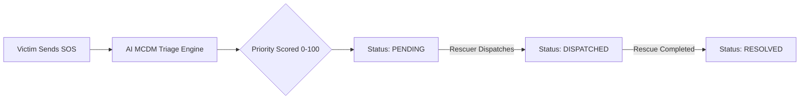

# DisasterLens 🚨

> **AI-Powered Disaster Intelligence & Emergency Triage Platform**  
> Connecting victims with rescue teams through real-time SOS signaling, explainable AI triage prioritization, live tactical maps, and offline-resilient mesh communication.

[](https://nextjs.org/)
[](https://react.dev/)
[](https://www.typescriptlang.org/)
[](https://tailwindcss.com/)
[](https://leafletjs.com/)

---

## 📌 Overview

During natural disasters and mass-casualty incidents, emergency dispatch centers are flooded with unstructured, panicky distress signals. Rescue teams struggle with information overload, leading to critical delays in response time.

**DisasterLens** addresses this bottleneck with an **Explainable AI Multi-Criteria Decision Making (MCDM)** triage engine that instantly assesses incoming SOS alerts, ranks them by life-threat severity, and visualizes them on real-time tactical maps for coordinated rescue response.

Built by students from the Department of Computer Science & Engineering at **Kalpataru Institute of Technology, Tiptur**.

---

## ✨ Key Features

### 🧠 Explainable AI Triage (MCDM Engine) & Interactive Sandbox
Scores every incoming SOS transmission from **0 to 100** based on five mission-critical weighted dimensions:
* **Battery Level (25%)**: Low phone battery elevates priority before imminent communication blackouts.
* **Disaster Category (30%)**: Structural collapses and trapped individuals receive highest priority.
* **Injury Severity (20%)**: Critical injuries and trauma are escalated immediately.
* **Group Size (15%)**: Trapped groups receive amplified priority based on casualty count.
* **Environmental Hazards (10%)**: Darkness, heavy flooding/rain, or severe temperatures.

> Includes an **Interactive MCDM Triage Sandbox** modal allowing commanders to test weight scenarios and review live explainable AI reasoning logs.

### 🛰️ Real Hardware Telemetry & Victim Emergency Tools
* **Live GPS Geolocation**: Direct browser GPS satellite locking with precision radius (`navigator.geolocation`).
* **Device Battery Status API**: Real-time battery drain percentage and charging state telemetry (`navigator.getBattery`).
* **Night Search-and-Rescue Strobe Beacon**: High-frequency visual strobe screen mode to guide aerial and ground search teams to trapped victims.
* **Voice Speech-to-Text SOS**: One-tap emergency voice dictation for injured victims who cannot type.

### 🗺️ Tactical Radar Maps & Bearing Navigation
* Dark-themed interactive CartoDB / Leaflet maps with rescuer unit position.
* **Tactical Bearing Vector**: Dynamic animated polyline connecting rescuer unit to the victim with real-time distance (km), compass bearing (e.g. `042° NE`), and estimated ground ETA.
* Color-coded priority pins: 🔴 **Critical (Animated Radar Pulse)** | 🟠 **High** | 🟡 **Medium**.

### ⚡ True Real-Time SSE Synchronization (Sub-100ms)
* Both dashboards utilize **Server-Sent Events (`/api/events`)** for instant synchronization when signals are dispatched or resolved, eliminating aggressive polling latency.

### 📶 Persistent Offline Mesh & Auto-Sync
* Offline mode caches distress signals and tactical chat in persistent local storage (`localStorage`).
* Automatically flushes and synchronizes all queued transmissions the moment network connectivity resumes.

### ⌨️ Tactical Keyboard Shortcuts & Audio Cues
* Quick keyboard actions for dispatchers (`1`–`9` to select signals, `D` to dispatch, `R` to resolve).
* Distinct Web Audio API tones synthesized for incoming alerts, message notifications, and dispatch confirmations.

---

## 🛠️ Tech Stack

| Domain | Technology |
|---|---|
| **Framework** | [Next.js 16](https://nextjs.org/) (App Router, Server Actions, Route Handlers) |
| **Frontend** | [React 19](https://react.dev/), [Tailwind CSS 4](https://tailwindcss.com/) |
| **Language** | [TypeScript 5](https://www.typescriptlang.org/) |
| **Maps** | [Leaflet 1.9](https://leafletjs.com/), [react-leaflet 5](https://react-leaflet.js.org/) |
| **Authentication** | JWT (`jsonwebtoken`), `bcryptjs`, secure HTTP-only cookies |
| **Icons & UI** | [Lucide React](https://lucide.dev/), Font Awesome |
| **Data Layer** | Flat-file JSON Database (`data_store.json`) with Prisma client support |

---

## 🚀 Getting Started

### Prerequisites
* **Node.js** (v18.18 or higher recommended)
* **npm**, **pnpm**, or **yarn**

### 1. Clone the Repository
```bash
git clone https://github.com/Lohith-RC/DisasterLens.git
cd DisasterLens
```

### 2. Install Dependencies
```bash
npm install
```

### 3. Setup Environment Variables
Create your local environment file from `.env.example`:
```bash
cp .env.example .env
```
*(Or on Windows PowerShell: `Copy-Item .env.example .env`)*

### 4. Initialize Demo Database
Run the seed endpoint to initialize demo users and Bangalore emergency locations:
```bash
# Start dev server first:
npm run dev
```
Then navigate in your browser or make a request to:
```
http://localhost:3000/api/seed
```
*(Or click **"Initialize Database"** on the landing page)*

### 5. Open the Application
Visit [http://localhost:3000](http://localhost:3000) in your browser.

---

## 🔑 Demo Credentials

| Role | Name | Password | Dashboard |
|---|---|---|---|
| **Rescuer** | Arjun Mehta | `disaster123` | `/rescuer` |
| **Rescuer** | Sneha Reddy | `disaster123` | `/rescuer` |
| **Victim** | Vikram Rao | `disaster123` | `/victim` |
| **Victim** | Priya Sharma | `disaster123` | `/victim` |

---

## 📡 API Endpoints

| Method | Endpoint | Auth Required | Description |
|---|---|---|---|
| `POST` | `/api/auth/login` | None | Authenticates user and issues HTTP-only JWT |
| `POST` | `/api/auth/logout` | None | Terminates session cookie |
| `GET` | `/api/seed` | None | Resets and seeds demo accounts & distress data |
| `POST` | `/api/sos/create` | Victim (JWT) | Dispatches SOS distress signal and triggers AI MCDM triage |
| `GET` | `/api/sos/stream` | Rescuer (JWT) | Retrieves all active SOS signals |
| `POST` | `/api/sos/dispatch` | Rescuer (JWT) | Transitions signal status (`DISPATCHED` / `RESOLVED`) |
| `POST` | `/api/messages/send` | Authenticated | Sends two-way tactical communication message |
| `GET` | `/api/messages/stream` | Authenticated | Fetches message thread history |

---

## 🔄 Signal Lifecycle


*Victims receive automatic status notifications at every stage.*

---

## 📂 Project Structure

```
DisasterLens/
├── src/
│   ├── app/
│   │   ├── page.tsx               # Landing & navigation portal
│   │   ├── login/page.tsx         # Role-based login interface
│   │   ├── victim/page.tsx        # Victim distress dashboard
│   │   ├── rescuer/page.tsx       # Rescuer command & tactical map
│   │   ├── globals.css            # Tailwind & custom CSS variables
│   │   └── api/
│   │       ├── auth/              # Login / logout handlers
│   │       ├── seed/              # Data seeding route
│   │       ├── sos/               # SOS creation, stream & dispatch routes
│   │       └── messages/          # Real-time messaging endpoints
│   ├── components/
│   │   └── Map.tsx                # Leaflet tactical map component
│   ├── lib/
│   │   ├── auth.ts                # JWT verification & cookie utilities
│   │   ├── db_json.ts             # Lightweight local datastore
│   │   └── db.ts                  # Database client
│   └── middleware.ts              # Route guards & JWT authentication check
├── prisma/
│   └── schema.prisma              # Database schema definitions
├── public/                        # Static assets & map markers
├── .env.example                   # Sample environment configuration
├── package.json                   # Dependencies and scripts
└── README.md                      # Project documentation
```

---

## 🎓 Academic Credits

Developed by 10 students from the Department of Computer Science & Engineering at **Kalpataru Institute of Technology, Tiptur**.

---

## 📄 License

Academic and educational use — Kalpataru Institute of Technology.
